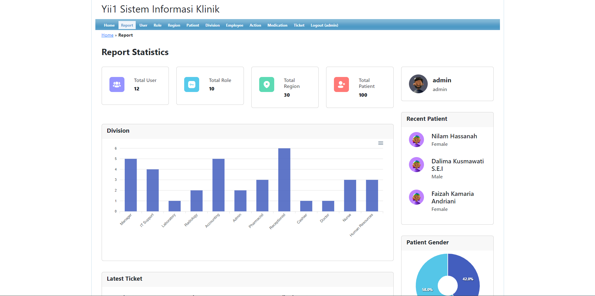
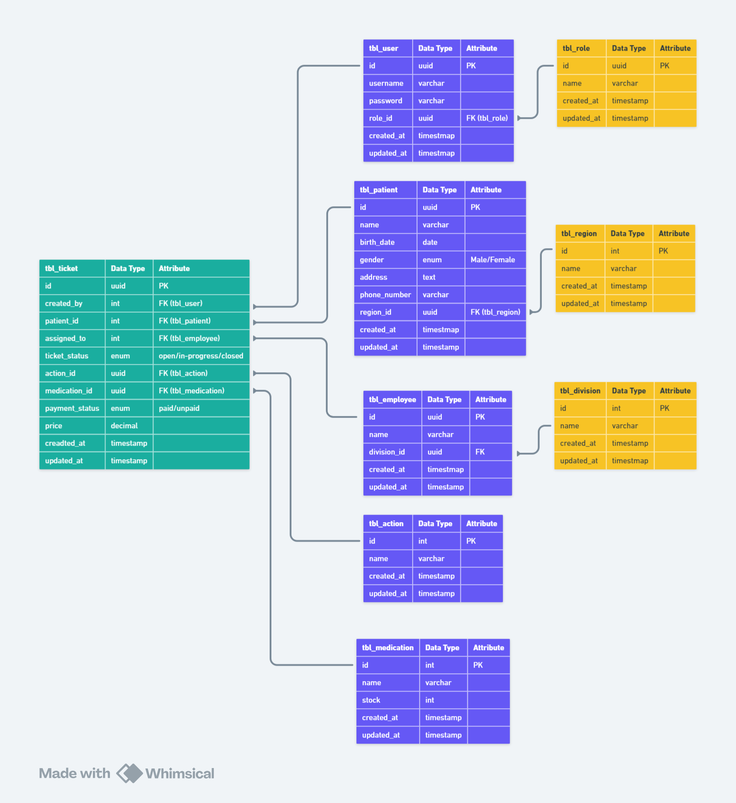

<h1 align="center">Yii1 - Sistem Informasi Klinik</h1>

<div align="center">

&nbsp;
&nbsp;
&nbsp;
&nbsp;

</div>



<p align="center">Sistem Information Klinik adalah aplikasi berbasis web yang dirancang untuk mengelola data dan operasi yang terkait dengan layanan klinik kesehatan. Aplikasi ini menawarkan berbagai fitur untuk memfasilitasi manajemen pasien, staf klinik (dokter, perawat, dan staf pendukung), ticketing, rekam medis, serta laporan dan statistik yang berkaitan dengan operasional klinik.</p>

## Table of Contents

- [Teknologi Yang Digunakan](#teknologi-yang-digunakan)
- [Entity Relationship Diagram](#entity-relationship-diagram-erd)
- [Menjalankan di Localhost](#menjalankan-di-localhost)
- [List Default Account Login](#list-default-account-login)

## Teknologi Yang Digunakan

- [PHP](https://www.php.net/) (Programming Language): PHP adalah bahasa pemrograman server-side yang banyak digunakan untuk pengembangan web. Dengan PHP, Anda dapat membangun aplikasi web dinamis yang interaktif dan responsif. PHP dikenal karena kemudahan penggunaannya dan kemampuannya untuk terintegrasi dengan berbagai database.

- [Bootstrap](https://getbootstrap.com/) (CSS Framework): Bootstrap adalah framework CSS yang membantu dalam membangun desain web yang responsif dan modern. Dengan komponen-komponennya yang siap pakai seperti grid sistem, tombol, dan formulir, Bootstrap mempercepat proses pengembangan antarmuka pengguna dengan tampilan yang konsisten dan profesional di berbagai perangkat.

- [MariaDB](https://mariadb.org/) (Database): MariaDB adalah sistem manajemen basis data relasional yang merupakan fork dari MySQL. Sebagai basis data open-source, MariaDB menawarkan performa tinggi dan skalabilitas yang baik untuk aplikasi web. MariaDB mendukung SQL dan memiliki berbagai fitur untuk pengelolaan data yang efektif.

- [Nginx](https://www.nginx.com/) (Web Server): Nginx adalah server web open-source yang dikenal karena performa dan efisiensinya dalam menangani permintaan HTTP. Nginx berfungsi sebagai web server dan reverse proxy yang dapat meningkatkan kecepatan, keamanan, dan skalabilitas aplikasi web.

## Entity Relationship Diagram (ERD)



## Menjalankan di Localhost

Untuk menjalankan aplikasi sistem informasi klinik di localhost, ikuti langkah-langkah berikut:

1. Clone Repository

Clone repository dari GitHub ke lokal Anda dengan menggunakan perintah berikut:

> [!IMPORTANT]
> Simpan folder hasil cloning an repository ini didalam folder www atau htdocs (folder yang accessible untuk web server seperti Nginx atau Apache)

```bash
git clone https://github.com/armandwipangestu/yii1-klinik.git
cd yii1-klinik
```

2. Setup Database

> [!WARNING]
> Sebelum melakukan import database, buat terlebih dahulu database kosong menggunakan perintah berikut ini:
>
> ```sql
> CREATE DATABASE yii1_klinik;
> ```

- Import file dump database `yii1_klinik.sql` yang terletak di root folder aplikasi ke dalam MySQL. Gunakan perintah berikut di terminal atau command prompt:

> [!TIP]
> Jika kalian menggunakan terminal powershell bisa melakukan import database nya dengan perintah berikut ini
>
> ```ps
> Get-Content 'yii1_klinik.sql' | mysql -u [username] -p [database_name]
> ```

```bash
mysql -u [username] -p [database_name] < yii1_klinik.sql
```

> [!IMPORTANT]
> Gantilah `[username]` dengan nama pengguna MySQL Anda dan `[database_name]` dengan nama database yang Anda buat.

- Konfigurasi kredensial database di file `protected/config/database.php`. Buka file tersebut dan ubah pengaturan database sesuai dengan kredensial MySQL Anda:

```php
return array(
    'connectionString' => 'mysql:host=localhost;dbname=[database_name]',
    'emulatePrepare' => true,
    'username' => '[username]',
    'password' => '[password]',
    'charset' => 'utf8',
	'tablePrefix' => 'tbl_',
);
```

> [!IMPORTANT]
> Gantilah `[database_name]`, `[username]`, dan `[password]` dengan informasi yang sesuai.

3. Instalasi Dependensi

Jika aplikasi menggunakan Composer, jalankan perintah berikut untuk menginstal dependensi yang diperlukan:

```bash
composer install
```

4. Menjalankan Aplikasi

Jalankan Server Web lokal menggunakan PHP built-in server dengan perintah berikut:

```bash
php yii/yiic.php webapp
```

Atau, jika Anda menggunakan server web seperti Apache atau Nginx, pastikan konfigurasi server Anda mengarah ke folder `yii1-klinik`.

5. Akses Aplikasi

Buka browser Anda dan akses aplikasi di `http://localhost/[path_to_application]` untuk melihat aplikasi berjalan di localhost.

> [!NOTE]
> Jika Anda mengalami masalah selama proses ini, pastikan Anda memeriksa konfigurasi database dan dependensi yang diperlukan.

## List Default Account Login

| Username | Password | Role  |
| -------- | -------- | ----- |
| admin    | admin    | admin |
| demo     | demo     | user  |
